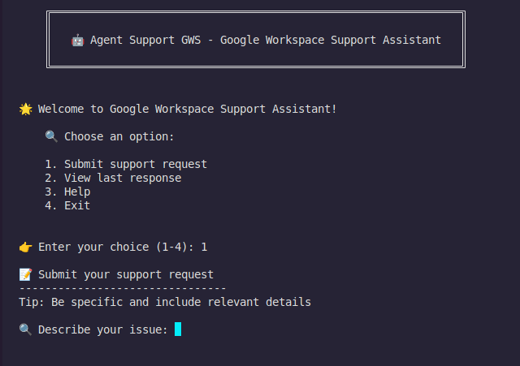

# 🤖 Agent Support GWS - Google Workspace Support Assistant

An AI-powered assistant specialized in Google Workspace support, using the CrewAI library to provide accurate and contextualized responses in Brazilian Portuguese.



## 🛠️ Built With Amazing Technologies

<div align="center">
  
  
  
</div>

### Core Technologies

- **[Python](https://python.org)** (3.10+) - The foundation of our application
- **[OpenAI GPT](https://openai.com)** - Powerful language model for intelligent responses
- **[LangChain](https://langchain.org)** - Framework for building language model applications
- **[CrewAI](https://crewai.com)** - Multi-agent framework for complex task handling
- **[dotenv](https://pypi.org/project/python-dotenv/)** - Environment variable management

## 🚀 Features

- ✨ Intelligent support request analysis
- 🔍 Automatic severity classification
- 📝 Detailed step-by-step solutions
- 🔒 Security recommendations
- 🌐 Responses in Brazilian Portuguese
- 💾 Automatic response storage

## 🛠️ Technologies Used

- Python 3.10+
- CrewAI
- LangChain
- OpenAI GPT
- dotenv

## 📋 Prerequisites

- Python 3.10 or higher
- OpenAI API Key
- Python virtual environment (recommended)

## ⚙️ Installation

1. Clone the repository

2. Create and activate a virtual environment:
```bash
python -m venv venv
source venv/bin/activate  # Linux/Mac
# or
venv\Scripts\activate  # Windows
```

3. Install dependencies:
```bash
pip install -r requirements.txt
```

4. Configure environment variables:
```bash
cp .env.example .env
# Edit the .env file and add your OpenAI API key
```

## 🚀 Usage

1. Run the assistant:
```bash
python agent_supoort_gws.py
```

2. Enter your support request when prompted
3. The system will:
   - Analyze your request
   - Classify severity
   - Generate a detailed solution
   - Review the solution
   - Translate to Brazilian Portuguese
   - Save the response to a file

## 📁 Project Structure

```
agent-support-gws/
├── agent_supoort_gws.py    # Main file
├── requirements.txt        # Dependencies
├── .env                   # Configuration (not versioned)
└── support_responses/    # Saved responses directory
```

## 🤝 Contributing

1. Fork the project
2. Create your Feature Branch (`git checkout -b feature/AmazingFeature`)
3. Commit your changes (`git commit -m 'Add some AmazingFeature'`)
4. Push to the Branch (`git push origin feature/AmazingFeature`)
5. Open a Pull Request

## 📝 License

This project is under the MIT license.

## 👤 Author

Leo Gama
- GitHub: [@LeoGamaJ](https://github.com/LeoGamaJ)
- Email: leo@leogama.cloud 
- LinkedIn: (https://www.linkedin.com/in/leonardo-gama-jardim/)


## 🌟 Key Features

- **Multi-Agent System**: Uses specialized agents for analysis, technical solutions, and expert review
- **Intelligent Analysis**: Automatically classifies and prioritizes support requests
- **Security Focus**: Includes security recommendations and best practices
- **Language Processing**: Provides responses in Brazilian Portuguese while maintaining technical accuracy
- **Automated Documentation**: Saves all responses with timestamps and request details
- **Enterprise Ready**: Designed for Google Workspace enterprise support scenarios
